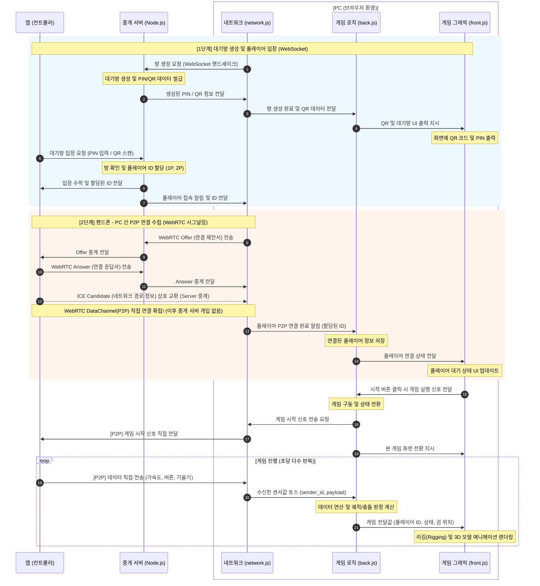

```mermaid
sequenceDiagram
    autonumber
    participant App as 앱 (컨트롤러)
    participant Server as 중개 서버 (Node.js)

    box transparent [PC (브라우저 환경)]
    participant Net as 네트워크 (network.js)
    participant Back as 게임 로직 (back.js)
    participant Front as 게임 그래픽 (front.js)
    end

    %% 1. 대기방 구성 단계 (WebSocket)
    rect rgb(240, 248, 255)
    Note over App, Front: [1단계] 대기방 생성 및 플레이어 입장 (WebSocket)
    Net->>Server: 방 생성 요청 (WebSocket 핸드셰이크)
    Note over Server: 대기방 생성 및 PIN/QR 데이터 발급
    Server->>Net: 생성된 PIN / QR 정보 전달
    Net->>Back: 방 생성 완료 및 QR 데이터 전달
    Back->>Front: QR 및 대기방 UI 출력 지시
    Note over Front: 화면에 QR 코드 및 PIN 출력

    App->>Server: 대기방 입장 요청 (PIN 입력 / QR 스캔)
    Note over Server: 방 확인 및 플레이어 ID 할당 (1P, 2P)
    Server->>App: 입장 수락 및 할당된 ID 전달
    Server->>Net: 플레이어 접속 알림 및 ID 전달
    end

    %% 2. P2P 연결 구성 단계 (WebRTC Signaling)
    rect rgb(255, 245, 238)
    Note over App, Net: [2단계] 핸드폰 - PC 간 P2P 연결 수립 (WebRTC 시그널링)
    Net->>Server: WebRTC Offer (연결 제안서) 전송
    Server->>App: Offer 중계 전달
    App->>Server: WebRTC Answer (연결 응답서) 전송
    Server->>Net: Answer 중계 전달
    App-->>Net: ICE Candidate (네트워크 경로 정보) 상호 교환 (Server 중계)
    Note over App, Net: WebRTC DataChannel(P2P) 직접 연결 확립! (이후 중개 서버 개입 없음)
    
    Net->>Back: 플레이어 P2P 연결 완료 알림 (할당된 ID)
    Note over Back: 연결된 플레이어 정보 저장
    Back->>Front: 플레이어 연결 상태 전달
    Note over Front: 플레이어 대기 상태 UI 업데이트
    end

    %% 3. 게임 시작 (P2P 직접 통신)
    Front->>Back: 시작 버튼 클릭 시 게임 실행 신호 전달
    Note over Back: 게임 구동 및 상태 전환
    Back->>Net: 게임 시작 신호 전송 요청
    Net->>App: [P2P] 게임 시작 신호 직접 전달
    Back->>Front: 본 게임 화면 전환 지시

    %% 4. 실시간 게임 루프 (P2P 직접 통신)
    loop 게임 진행 (초당 다수 반복)
        App->>Net: [P2P] 데이터 직접 전송 (가속도, 버튼, 기울기)
        Net->>Back: 수신한 센서값 토스 (sender_id, payload)
        Note over Back: 데이터 연산 및 궤적/충돌 판정 계산
        Back->>Front: 게임 전달값 (플레이어 ID, 상태, 검 위치)
        Note over Front: 리깅(Rigging) 및 3D 모델 애니메이션 렌더링
    end
     
```